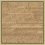
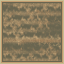

# 皇后棋
你可以移动“皇后”（横、竖或斜），并可以吃掉对方，走过的地方会产生障碍物\
如果路径上经过了障碍物或敌方“皇后”（而不是去吃它），你会被挡住

```insert-html
<canvas id="queen_game" width="512" height="576" onclick="clicks(event)">
	
	
	
	
	
	
</canvas>
<hr />
<button type="button" onclick="changeorder()">强制切换先后手</button>
<span id="info">轮到红方</span>
<script src="../../script/queen_main.js"></script>
```
